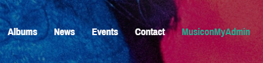

## Admin privilege
When the console first runs Laravel's seeding command, an admin account will be created with the following credentials:

Email: admin@theMusicon.com

Password: 1

User can then proceed to route "/administrator/home" to access admin's privileges.

Note: The sidebar is purely cosmetics. All content are in the navigation bar and in the main section. 
